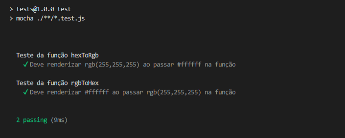

# Conversor de cores RGB - Hexadecimal / Hexadecimal - RGB

## Como funciona
O projeto contem 2 funções que fazem conversão do código das cores. Uma recebe uma entrada RGB no formato `rgb(xxx,xxx,xxx)` e converte para Hexadecimal no formato `#YYYYYY`. A outra faz o inverso, de Hexadecimal para RGB.

A proposta inclui um servidor com 2 enpoints, cada 1 apontando para uma das funções e tanbém testes para as funções.

O projeto é uma aplicação de backend, como não possui interface, para fazer consultas nos endpoints foi usado o *Postman* instalado localmente.

### Iniciando o projeto
- Pastas:
  - components: para as funções de conversão
  - server: para o servidor
  - tests: para testes

> `npm init -y` para criar o arquivo `package.json`

### Dependências
- Para testes
  - [x] mocha 
  - [x] chai
    - ` npm install --save-dev chai mocha `

- Para servidor
  - [x] express
  - [x] cross
  - [x] cross-env
  - [x] dotenv
  - [x] nodemon

### Ferramentas externas
- Postman

RGB para Hexadecimal

Hexadecimal para RGB

Teste rodando

 Participantes do grupo
---------------------
Nome|usuario github
----------|----------
Glaucia| galemagalhaes
Felipe| FelipeGeazi
Angelo| 0guilhermino
Jefferson|   